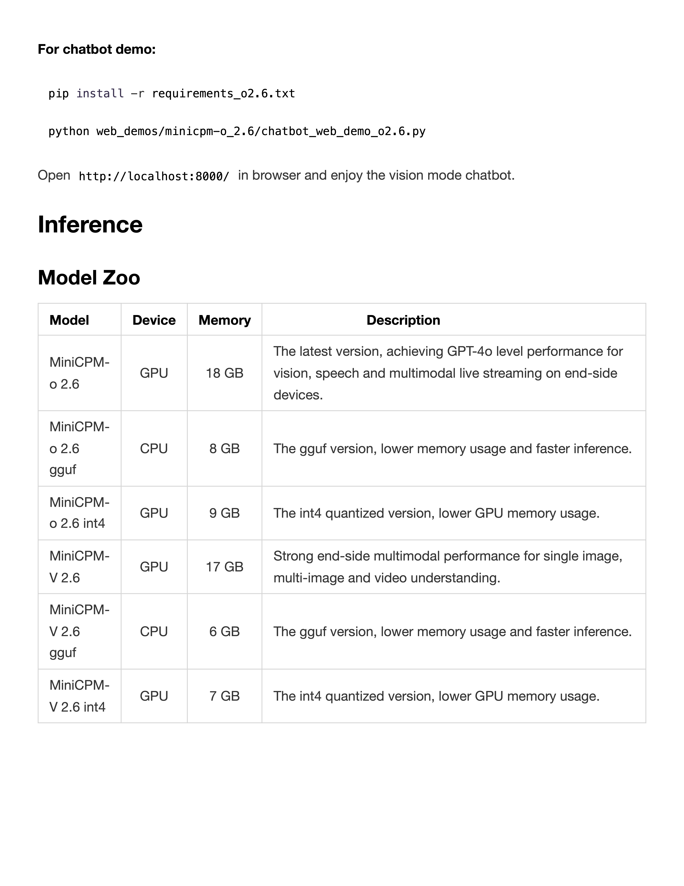

# PDF Parse

### Initialize model

```python
import torch
from transformers import AutoModel, AutoTokenizer

model_path = 'openbmb/MiniCPM-V-4'
model = AutoModel.from_pretrained(model_path, trust_remote_code=True,
                                  attn_implementation='sdpa', torch_dtype=torch.bfloat16)  # sdpa or flash_attention_2, no eager
model = model.eval().cuda()
tokenizer = AutoTokenizer.from_pretrained(
    model_path, trust_remote_code=True)
```

### PDF to image function

```python
#! need to install poppler-utils
# sudo apt-get update
# sudo apt-get install poppler-utils
from pdf2image import convert_from_path


def pdf_to_images(pdf_path, dpi=200):
    images = convert_from_path(pdf_path, dpi=dpi)
    images = [image.convert('RGB') for image in images]
    return images
```

### Usage example

```python
prompt = """
You are an OCR assistant. Your task is to identify and extract all visible text from the image provided. Preserve the original formatting as closely as possible, including:

- Line breaks and paragraphs  
- Headings and subheadings  
- Any tables, lists, bullet points, or numbered items  
- Special characters, spacing, and alignment  

Output strictly the extracted text in Markdown format, reflecting the layout and structure of the original image. Do not add commentary, interpretation, or summarization—only return the raw text content with its formatting.
"""

contents = [prompt]
contents.extend(pdf_to_images('assets/parse.pdf'))
msgs = [{'role': 'user', 'content': contents}]

answer = model.chat(msgs=msgs, image=None, tokenizer=tokenizer)
print(answer)
```

### Sample PDF



### Example Output

```
For chatbot demo:

pip install -r requirements_o2.6.txt
python web_demos/minicpm-o_2.6/chatbot_web_demo_o2.6.py

Open http://localhost:8000/ in browser and enjoy the vision mode chatbot.

Inference

Model Zoo

| Model | Device | Memory | Description |
|-------|--------|--------|-------------|
| MiniCPM-o 2.6 | GPU | 18 GB | The latest version, achieving GPT-4o level performance for vision, speech and multimodal live streaming on end-side devices. |
| MiniCPM-o 2.6 gguf | CPU | 8 GB | The gguf version, lower memory usage and faster inference. |
| MiniCPM-o 2.6 int4 | GPU | 9 GB | The int4 quantized version, lower GPU memory usage. |
| MiniCPM-V 2.6 | GPU | 17 GB | Strong end-side multimodal performance for single image, multi-image and video understanding. |
| MiniCPM-V 2.6 gguf | CPU | 6 GB | The gguf version, lower memory usage and faster inference. |
| MiniCPM-V 2.6 int4 | GPU | 7 GB | The int4 quantized version, lower GPU memory usage. |
```
