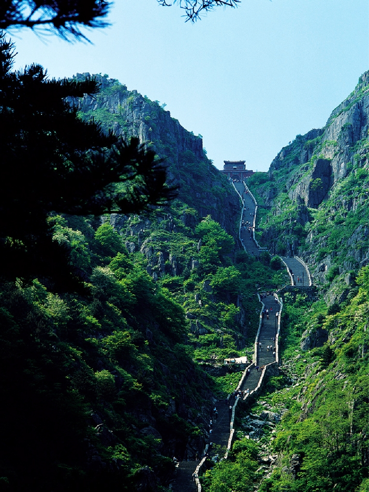

# Single Image

### Initialize model

```python
from PIL import Image
import torch
from transformers import AutoModel, AutoTokenizer

model_path = 'openbmb/MiniCPM-V-4'
model = AutoModel.from_pretrained(model_path, trust_remote_code=True,
                                  # sdpa or flash_attention_2, no eager
                                  attn_implementation='sdpa', torch_dtype=torch.bfloat16)
model = model.eval().cuda()
tokenizer = AutoTokenizer.from_pretrained(
    model_path, trust_remote_code=True)
```

### Chat with single image

```python
image = Image.open('./assets/single.png').convert('RGB')
display(image.resize((400, 400)))

# First round chat 
question = "What is the landform in the picture?"
msgs = [{'role': 'user', 'content': [image, question]}]

answer = model.chat(
    msgs=msgs,
    image=image,
    tokenizer=tokenizer
)
print(answer)
```

### Second round chat

```python
# Second round chat, pass history context of multi-turn conversation
msgs.append({"role": "assistant", "content": [answer]})
msgs.append({"role": "user", "content": [
            "What should I pay attention to when traveling here?"]})

answer = model.chat(
    msgs=msgs,
    image=None,
    tokenizer=tokenizer
)
print(answer)
```

### Sample Image



### Example Output

First round
```
The image depicts a mountainous landscape with steep cliffs and lush greenery. The landform in the picture is characterized by its rugged terrain, vertical rock faces, and dense vegetation typical of mountain environments.
```

Second round
```
When traveling in such mountainous areas, it's important to be mindful of the steep and winding paths. Make sure you have sturdy footwear for hiking or walking on uneven surfaces. Additionally, stay hydrated and carry enough supplies as trails can sometimes lack amenities. It’s also wise to check weather conditions before heading out, as they can change rapidly at higher altitudes.
```
